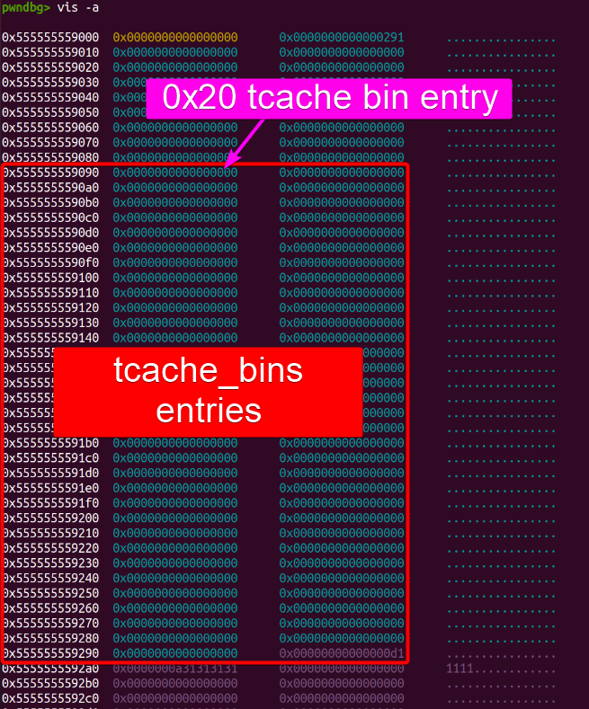
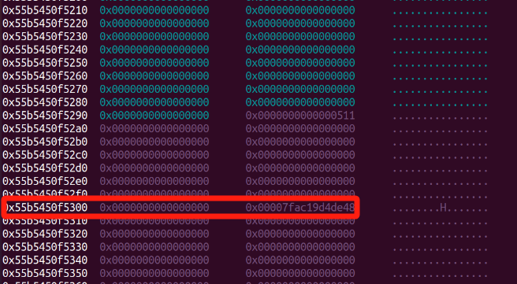
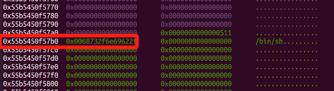

[toc]

## Struct

### Struct malloc_par

`struct malloc_par` (the structure for `mp_`):

```
ptype /o struct malloc_par
```

```c
/* offset    |  size */  type = struct malloc_par {
/*   0x0     |     8 */    unsigned long trim_threshold;
/*   0x8     |     8 */    size_t top_pad;
/*  0x10     |     8 */    size_t mmap_threshold;
/*  0x18     |     8 */    size_t arena_test;
/*  0x20     |     8 */    size_t arena_max;
/*  0x28     |     4 */    int n_mmaps;
/*  0x2c     |     4 */    int n_mmaps_max;
/*  0x30     |     4 */    int max_n_mmaps;
/*  0x34     |     4 */    int no_dyn_threshold;
/*  0x38     |     8 */    size_t mmapped_mem;
/*  0x40     |     8 */    size_t max_mmapped_mem;
/*  0x48     |     8 */    char *sbrk_base;
/*  0x50     |     8 */    size_t tcache_bins;
/*  0x58     |     8 */    size_t tcache_max_bytes;
/*  0x60     |     8 */    size_t tcache_count;
/*  0x68     |     8 */    size_t tcache_unsorted_limit;

                           /* total size (bytes):  0x70 */
                         }
```

1. **`trim_threshold`** (`0x0`):
   - Defines the threshold for releasing free memory back to the operating system.
   - When the top chunk exceeds this size, `malloc` may release it with `sbrk` or `mmap` to save memory.
2. **`top_pad`** (`0x8`):
   - Extra padding added to the top of the heap for larger allocations.
   - It’s useful for reducing frequent system calls for small increases in heap size.
3. **`mmap_threshold`** (`0x10`):
   - Size threshold for using `mmap` instead of `sbrk` for memory allocation.
   - Allocations larger than this value will be directly mapped instead of being added to the heap.
4. **`arena_test`** (`0x18`):
   - A parameter used in testing or debugging.
   - Defines the frequency of arenas created to test arena usage in multi-threaded applications.
5. **`arena_max`** (`0x20`):
   - Sets the maximum number of arenas for memory allocation.
   - Arenas are used to handle memory allocation in multi-threaded applications, with each arena isolated per thread to prevent race conditions.
6. **`n_mmaps`** (`0x28`):
   - Tracks the current number of `mmap`-based allocations.
   - It’s useful for monitoring overall `mmap` usage.
7. **`n_mmaps_max`** (`0x2c`):
   - The maximum number of simultaneous `mmap` allocations.
   - A diagnostic value that helps in limiting or observing `mmap` usage patterns.
8. **`max_n_mmaps`** (`0x30`):
   - Sets an upper limit on the number of `mmap` allocations allowed.
9. **`no_dyn_threshold`** (`0x34`):
   - Controls whether `mmap_threshold` should be dynamic (adjustable).
   - When set, `malloc` won’t adjust the threshold dynamically based on memory usage.
10. **`mmapped_mem`** (`0x38`):
    - Tracks the total memory currently allocated using `mmap`.
11. **`max_mmapped_mem`** (`0x40`):
    - Records the peak memory allocated using `mmap`.
    - Useful for diagnostics and for observing memory usage trends.
12. **`sbrk_base`** (`0x48`):
    - Base address of the heap, initially set by the `sbrk` system call.
    - This is where the main heap space begins, and `malloc` typically allocates from here.
13. **`tcache_bins`** (`0x50`):
    - Number of `tcache` bins available for caching freed memory.
    - Defaults to 64 bins for small allocations, helping speed up small allocations by reducing system calls.
14. **`tcache_max_bytes`** (`0x58`):
    - Maximum size of allocations that can be stored in `tcache`.
    - Allocations above this size won’t be cached in `tcache` but handled by other mechanisms.
15. **`tcache_count`** (`0x60`):
    - Maximum number of chunks each `tcache` bin can hold.
    - By default, each bin holds up to 7 chunks, which can be expanded by adjusting this value.
16. **`tcache_unsorted_limit`** (`0x68`):
    - Controls when freed chunks in `tcache` are moved to the unsorted bin.
    - Helps manage cache overflow and keeps `tcache` efficient by moving excess chunks to the main bins.

### mp_

```
p &mp_
# $5 = (struct malloc_par *) 0x7ffff7fb0280 <mp_>

p *((struct malloc_par *)0x7ffff7fb0280)
```

Example `mp_`:

```c
$6 = {
  trim_threshold = 131072,
  top_pad = 131072,
  mmap_threshold = 131072,
  arena_test = 8,
  arena_max = 0,
  n_mmaps = 0,
  n_mmaps_max = 65536,
  max_n_mmaps = 0,
  no_dyn_threshold = 0,
  mmapped_mem = 0,
  max_mmapped_mem = 0,
  sbrk_base = 0x555555559000 "",
  tcache_bins = 64,
  tcache_max_bytes = 1032,
  tcache_count = 7,
  tcache_unsorted_limit = 0
}
```


## Attack mp_.tcache_bins

In source code:

```c
typedef struct tcache_perthread_struct {
    uint16_t counts[TCACHE_MAX_BINS];
    tcache_entry* entries[TCACHE_MAX_BINS];
} tcache_perthread_struct;
```

In GDB:

```c
/* offset    |  size   */  type = struct tcache_perthread_struct {
/*    0      |   0x80  */    uint16_t counts[64];
/*  128      |   0x200 */    tcache_entry *entries[64];

                           /* total size (bytes):  640 */
                         } 
```

`counts[TCACHE_MAX_BINS]` is a constant, but it will not be referenced in our **Attack Chain**:

```c
__libc_malloc
         └───► mp_.tcache_bins
```

Usual `tcache_perthread_struct`:



If we manage to overwirte `mp_.tcache_bins` to a large number, this structure will extend and the first chunk allocated starting at offset `0x290` from heap base, will be considered tcache-bin entries for larger chunks.


```c
// in 64-biut Linux
// MINSIZE=0x20
// MALLOC_ALIGNMENT=2*SIZE_SZ=0x10）
# define csize2tidx(x) (((x) - MINSIZE + MALLOC_ALIGNMENT - 1) / MALLOC_ALIGNMENT)
```

- **`x`**: The chunk size we want to target. This is the chunk allocation size, includes the metadata `glibc` uses to manage the chunk (often called the chunk header)..
- **`MINSIZE`**: The minimum chunk size, which is typically `0x20` on `x86_64` with `glibc`.
- **`MALLOC_ALIGNMENT`**: It equals `2*SIZE_SZ`, namely `0x10` (16 bytes) on `x86_64`.

for the chunk size `x`:

```
x = tidx * MALLOC_ALIGNMENT + MINSIZE
```

In `x86_64`:

```
x = tidx * 0x10 + 0x20
```

To calculate `tidx`:

```
tidx = (x - 0x20) / 0x10
```

### Template

```py
# mp_.tcache_bins = 0xdeadbeef

free_hook = libc_base + libc.sym['__free_hook']

# If malloc(0x500)
tidx = (0x510 - 0x20) / 0x10	# 0x4f
offset_to_bin = 0x90 + (tidx * 8)	# offset: 0x308

"""
Then,
write '/bin/sh\x00' into the pointer of 1st allocated chunk for tcache:
	heap_base + 0x2a0 
write __free_hook into following address:
	heap_base + offset_to_bin 
"""
```

Tcache entry at offset 0x308 from heap base:



The chunk we are going to free after setup:




