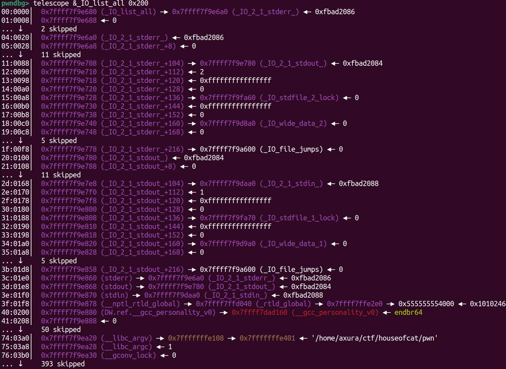

The `_IO_list_all` structure is part of the GNU C Library (glibc) I/O system, used to manage file streams such as `stdin`, `stdout`, and `stderr`. It is essentially a **doubly linked list** of file stream objects, where each node represents an open file or a standard I/O stream (e.g., `stdin`, `stdout`, `stderr`).



```
pwndbg> telescope &_IO_list_all 0x200
00:0000│  0x7ffff7f9e680 (_IO_list_all) —▸ 0x7ffff7f9e6a0 (_IO_2_1_stderr_) ◂— 0xfbad2086
01:0008│  0x7ffff7f9e688 ◂— 0
... ↓     2 skipped
04:0020│  0x7ffff7f9e6a0 (_IO_2_1_stderr_) ◂— 0xfbad2086
05:0028│  0x7ffff7f9e6a8 (_IO_2_1_stderr_+8) ◂— 0
... ↓     11 skipped
11:0088│  0x7ffff7f9e708 (_IO_2_1_stderr_+104) —▸ 0x7ffff7f9e780 (_IO_2_1_stdout_) ◂— 0xfbad2084
12:0090│  0x7ffff7f9e710 (_IO_2_1_stderr_+112) ◂— 2
13:0098│  0x7ffff7f9e718 (_IO_2_1_stderr_+120) ◂— 0xffffffffffffffff
14:00a0│  0x7ffff7f9e720 (_IO_2_1_stderr_+128) ◂— 0
15:00a8│  0x7ffff7f9e728 (_IO_2_1_stderr_+136) —▸ 0x7ffff7f9fa60 (_IO_stdfile_2_lock) ◂— 0
16:00b0│  0x7ffff7f9e730 (_IO_2_1_stderr_+144) ◂— 0xffffffffffffffff
17:00b8│  0x7ffff7f9e738 (_IO_2_1_stderr_+152) ◂— 0
18:00c0│  0x7ffff7f9e740 (_IO_2_1_stderr_+160) —▸ 0x7ffff7f9d8a0 (_IO_wide_data_2) ◂— 0
19:00c8│  0x7ffff7f9e748 (_IO_2_1_stderr_+168) ◂— 0
... ↓     5 skipped
1f:00f8│  0x7ffff7f9e778 (_IO_2_1_stderr_+216) —▸ 0x7ffff7f9a600 (_IO_file_jumps) ◂— 0
20:0100│  0x7ffff7f9e780 (_IO_2_1_stdout_) ◂— 0xfbad2084
21:0108│  0x7ffff7f9e788 (_IO_2_1_stdout_+8) ◂— 0
... ↓     11 skipped
2d:0168│  0x7ffff7f9e7e8 (_IO_2_1_stdout_+104) —▸ 0x7ffff7f9daa0 (_IO_2_1_stdin_) ◂— 0xfbad2088
2e:0170│  0x7ffff7f9e7f0 (_IO_2_1_stdout_+112) ◂— 1
2f:0178│  0x7ffff7f9e7f8 (_IO_2_1_stdout_+120) ◂— 0xffffffffffffffff
30:0180│  0x7ffff7f9e800 (_IO_2_1_stdout_+128) ◂— 0
31:0188│  0x7ffff7f9e808 (_IO_2_1_stdout_+136) —▸ 0x7ffff7f9fa70 (_IO_stdfile_1_lock) ◂— 0
32:0190│  0x7ffff7f9e810 (_IO_2_1_stdout_+144) ◂— 0xffffffffffffffff
33:0198│  0x7ffff7f9e818 (_IO_2_1_stdout_+152) ◂— 0
34:01a0│  0x7ffff7f9e820 (_IO_2_1_stdout_+160) —▸ 0x7ffff7f9d9a0 (_IO_wide_data_1) ◂— 0
35:01a8│  0x7ffff7f9e828 (_IO_2_1_stdout_+168) ◂— 0
... ↓     5 skipped
3b:01d8│  0x7ffff7f9e858 (_IO_2_1_stdout_+216) —▸ 0x7ffff7f9a600 (_IO_file_jumps) ◂— 0
3c:01e0│  0x7ffff7f9e860 (stderr) —▸ 0x7ffff7f9e6a0 (_IO_2_1_stderr_) ◂— 0xfbad2086
3d:01e8│  0x7ffff7f9e868 (stdout) —▸ 0x7ffff7f9e780 (_IO_2_1_stdout_) ◂— 0xfbad2084
3e:01f0│  0x7ffff7f9e870 (stdin) —▸ 0x7ffff7f9daa0 (_IO_2_1_stdin_) ◂— 0xfbad2088
3f:01f8│  0x7ffff7f9e878 (__nptl_rtld_global) —▸ 0x7ffff7ffd040 (_rtld_global) —▸ 0x7ffff7ffe2e0 —▸ 0x555555554000 ◂— 0x10102464c457f
40:0200│  0x7ffff7f9e880 (DW.ref.__gcc_personality_v0) —▸ 0x7ffff7dad160 (__gcc_personality_v0) ◂— endbr64 
41:0208│  0x7ffff7f9e888 ◂— 0
... ↓     50 skipped
74:03a0│  0x7ffff7f9ea20 (__libc_argv) —▸ 0x7fffffffe108 —▸ 0x7fffffffe401 ◂— '/home/axura/ctf/houseofcat/pwn'
75:03a8│  0x7ffff7f9ea28 (__libc_argc) ◂— 1
76:03b0│  0x7ffff7f9ea30 (__gconv_lock) ◂— 0
... ↓     393 skipped
```

**Structure**:

1. **_IO_list_all**:
   This is a global variable in glibc that maintains a linked list of all open file streams, starting with standard streams like `stdout`, `stderr`, and `stdin`. Each node in this list is a `_IO_FILE` structure that describes a file stream.
2. **_IO_FILE Structures**:
   The `FILE` structure, also known internally as `_IO_FILE`, represents each file stream. This structure stores information about the stream, including buffer pointers, file descriptor, error flags, and other metadata. Common examples are:
   - `_IO_2_1_stdin_`: Standard input (`stdin`).
   - `_IO_2_1_stdout_`: Standard output (`stdout`).
   - `_IO_2_1_stderr_`: Standard error (`stderr`).
3. **Structure Walkthrough**:
   - **_IO_list_all** (address `0x7ffff7f9e680`) points to `_IO_2_1_stderr_` at `0x7ffff7f9e6a0`, indicating that `stderr` is the first node in the list.
   - `_IO_2_1_stderr_` contains various fields:
     - `0xfbad2086`: This is the internal state of `stderr`, which indicates the stream’s flags (whether it is open, in error, etc.).
     - Other fields hold information like the buffer pointers, current position in the buffer, etc.
   - `_IO_2_1_stdout_` and `_IO_2_1_stdin_` are similarly represented and linked in the list.
   - The `stdout` node (`_IO_2_1_stdout_`) follows `stderr` in the list, and `stdin` follows `stdout`.

**Nodes**:

- **First Node (`_IO_2_1_stderr_`)**:
  - This is the standard error stream. It starts at address `0x7ffff7f9e6a0`, and the structure holds important details about the `stderr` stream, including:
    - The state flag `0xfbad2086`, indicating that `stderr` is open and ready for I/O.
    - The next node in the list is `stdout`, linked at offset `+104` (`0x7ffff7f9e780`), pointing to `_IO_2_1_stdout_`.
- **Second Node (`_IO_2_1_stdout_`)**:
  - This represents the `stdout` stream, starting at address `0x7ffff7f9e780`. It follows a similar pattern, showing the state of `stdout` (`0xfbad2084`), which is an indicator of its internal state.
  - `stdout` also links to the `stdin` stream at offset `+104`, pointing to `_IO_2_1_stdin_`.
- **Third Node (`_IO_2_1_stdin_`)**:
  - This is the `stdin` stream, located at `0x7ffff7f9daa0`. It has its own set of flags (`0xfbad2088`) indicating that it's an input stream, and it represents the standard input file descriptor.