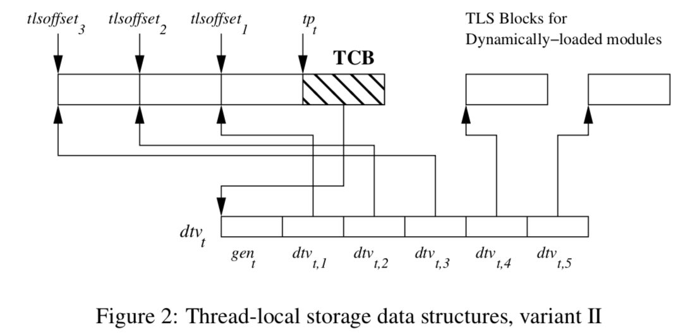

[toc]


## Illustration




## Structs

### struct tcbhead_t

`tcbhead_t`, is part of the **Thread Control Block (TCB)** in the GNU C Library (**glibc**). The **TCB** holds thread-specific information needed by the operating system and the C runtime (like `glibc`) to manage threads in a multi-threaded environment.

```c
type = struct {
/*      0      |       8 */    void *tcb;
/*      8      |       8 */    dtv_t *dtv;
/*     16      |       8 */    void *self;
/*     24      |       4 */    int multiple_threads;
/*     28      |       4 */    int gscope_flag;
/*     32      |       8 */    uintptr_t sysinfo;
/*     40      |       8 */    uintptr_t stack_guard;		// offset 0x28
/*     48      |       8 */    uintptr_t pointer_guard;		// offset 0x30
/*     56      |      16 */    unsigned long unused_vgetcpu_cache[2];
/*     72      |       4 */    unsigned int feature_1;
/*     76      |       4 */    int __glibc_unused1;
/*     80      |      32 */    void *__private_tm[4];
/*    112      |       8 */    void *__private_ss;
/*    120      |       8 */    unsigned long long ssp_base;
/*    128      |     512 */    __128bits __glibc_unused2[8][4];
/*    640      |      64 */    void *__padding[8];

                               /* total size (bytes):  704 */
                             }
```

1. **`void \*tcb;`** (at offset `0`):
   - This is a pointer to the TCB itself or to related thread-specific data.
   - It's used by the runtime to keep track of the thread’s control block.
2. **`dtv_t \*dtv;`** (at offset `8`):
   - The **DTV** (Dynamic Thread Vector) is a structure used for dynamic linking. It stores information about the thread's dynamic libraries, specifically for the runtime linking of shared libraries.
3. **`void \*self;`** (at offset `16`):
   - This field typically points to the `tcbhead_t` structure itself (i.e., a pointer to itself), making it easier to reference the current thread's TCB.
4. **`int multiple_threads;`** (at offset `24`):
   - A flag indicating whether the process is using multiple threads. If this is set to 1, multiple threads are running; otherwise, the process is single-threaded.
5. **`int gscope_flag;`** (at offset `28`):
   - This is a glibc-specific field, typically related to the scope of global variables for the thread. It's not often used directly in application code but is part of glibc's internal management of thread-specific features.
6. **`uintptr_t sysinfo;`** (at offset `32`):
   - This field stores system information, such as the address of system calls or functions in the vDSO (Virtual Dynamic Shared Object). It helps threads efficiently access kernel services.
7. **`uintptr_t stack_guard;`** (at offset `40`):
   - A **stack guard** value, used for **stack smashing protection (SSP)**. This helps detect stack overflows and prevent certain types of buffer overflow exploits.
8. **`uintptr_t pointer_guard;`** (at offset `48`):
   - A **pointer guard** value, another security feature that helps prevent attackers from tampering with function pointers or other critical data structures.
9. **`unsigned long unused_vgetcpu_cache[2];`** (at offset `56`):
   - This field is used internally for CPU caching in some versions of glibc, specifically for the `vgetcpu` system call, which provides information about the CPU and NUMA node the thread is currently running on.
10. **`unsigned int feature_1;`** (at offset `72`):
    - This is used by glibc to store feature flags related to thread capabilities or CPU-specific optimizations.
11. **`int __glibc_unused1;`** (at offset `76`):
    - An unused or reserved field, likely for future use or padding.
12. **`void \*__private_tm[4];`** (at offset `80`):
    - This is a private field used by glibc's transactional memory implementation.
13. **`void \*__private_ss;`** (at offset `112`):
    - Another private field, possibly related to signal handling or stack switching.
14. **`unsigned long long ssp_base;`** (at offset `120`):
    - Likely stores the base address used for stack smashing protection (SSP).
15. **`__128bits __glibc_unused2[8][4];`** (at offset `128`):
    - This is a reserved field, possibly for future extensions. It holds 128-bit values, but its purpose is currently unused by glibc.
16. **`void \*__padding[8];`** (at offset `640`):
    - Padding to align the structure to a certain size, ensuring memory alignment and possibly keeping space for future fields.


### Array DTV

It's an 2-dimensional array,  a [member variable](https://sourceware.org/git/?p=glibc.git;a=blob;f=sysdeps/x86_64/nptl/tls.h;h=e88561c93412489e532af8e388a8eeb1f879b771;hb=437faa9675dd916ac7b239d4584b932a11fbb984#l46) of `tcbheader_t`, which in turn is [first member variable](https://sourceware.org/git/?p=glibc.git;a=blob;f=nptl/descr.h;h=9c01e1b9863b178c174508b78c7772e71ffdc5ba;hb=437faa9675dd916ac7b239d4584b932a11fbb984#l127) of TCB `pthread`.

```c
dtv[-1].counter; /* Pro tip: The length of this dtv array */
dtv[0].counter;  /* Generation counter for the DTV in this thread */
dtv[1].pointer;  /* Pointer to the main executable TLS block in this thread */

/* Pointer to a TLS variable defined in a module id `ti_module` */
main_tls_var = *(dtv[tls_index.ti_module].pointer + tls_index.ti_offset);
```

**Chain**:

```
pthread_create
	ALLOC_STACK
		_dl_allocate_tls
			allocate_dtv
				_dl_allocate_tls_init
```

### struct pthread

```c
struct pthread {
    union {                                // Offset: 0x00, Size: 0x2C0 (704 bytes)
        tcbhead_t header;                  // Offset: 0x00, Size: 0x2C0
        void *__padding[24];               // Offset: 0x00, Size: 0xC0
    } tcb_union;
    list_t list;                           // Offset: 0x2C0, Size: 0x10
    pid_t tid;                             // Offset: 0x2D0, Size: 0x04
    pid_t pid_ununsed;                     // Offset: 0x2D4, Size: 0x04
    void *robust_prev;                     // Offset: 0x2D8, Size: 0x08
    struct robust_list_head {              // Offset: 0x2E0, Size: 0x18
        void *list;                        // Offset: 0x2E0, Size: 0x08
        long futex_offset;                 // Offset: 0x2E8, Size: 0x08
        void *list_op_pending;             // Offset: 0x2F0, Size: 0x08
    } robust_head;
    struct _pthread_cleanup_buffer *cleanup;  // Offset: 0x2F8, Size: 0x08
    struct pthread_unwind_buf *cleanup_jmp_buf; // Offset: 0x300, Size: 0x08
    int cancelhandling;                    // Offset: 0x308, Size: 0x04
    int flags;                             // Offset: 0x30C, Size: 0x04
    struct pthread_key_data specific_1stblock[32]; // Offset: 0x310, Size: 0x200 (512 bytes)
    struct pthread_key_data *specific[32]; // Offset: 0x510, Size: 0x100 (256 bytes)
    _Bool specific_used;                   // Offset: 0x610, Size: 0x01
    _Bool report_events;                   // Offset: 0x611, Size: 0x01
    _Bool user_stack;                      // Offset: 0x612, Size: 0x01
    _Bool stopped_start;                   // Offset: 0x613, Size: 0x01
    int setup_failed;                      // Offset: 0x614, Size: 0x04
    int lock;                              // Offset: 0x618, Size: 0x04
    unsigned int setxid_futex;             // Offset: 0x61C, Size: 0x04
    hp_timing_t cpuclock_offset_ununsed;   // Offset: 0x620, Size: 0x08
    struct pthread *joinid;                // Offset: 0x628, Size: 0x08
    void *result;                          // Offset: 0x630, Size: 0x08
    struct sched_param {                   // Offset: 0x638, Size: 0x04
        int sched_priority;                // Offset: 0x638, Size: 0x04
    } schedparam;
    int schedpolicy;                       // Offset: 0x63C, Size: 0x04
    void *(*start_routine)(void *);        // Offset: 0x640, Size: 0x08
    void *arg;                             // Offset: 0x648, Size: 0x08
    td_eventbuf_t eventbuf;                // Offset: 0x650, Size: 0x18
    struct pthread *nextevent;             // Offset: 0x668, Size: 0x08
    struct _Unwind_Exception {             // Offset: 0x670, Size: 0x20
        union {                            // Offset: 0x670, Size: 0x20
            struct {                       // Offset: 0x670, Size: 0x20
                _Unwind_Exception_Class exception_class;  // Offset: 0x670, Size: 0x08
                _Unwind_Exception_Cleanup_Fn exception_cleanup; // Offset: 0x678, Size: 0x08
                _Unwind_Word private_1;    // Offset: 0x680, Size: 0x08
                _Unwind_Word private_2;    // Offset: 0x688, Size: 0x08
            };
            _Unwind_Word unwind_exception_align[2]; // Offset: 0x670, Size: 0x20
        };
    } exc;
    void *stackblock;                      // Offset: 0x690, Size: 0x08
    size_t stackblock_size;                // Offset: 0x698, Size: 0x08
    size_t guardsize;                      // Offset: 0x6A0, Size: 0x08
    size_t reported_guardsize;             // Offset: 0x6A8, Size: 0x08
    struct priority_protection_data *tpp;  // Offset: 0x6B0, Size: 0x08
    struct __res_state {                   // Offset: 0x6B8, Size: 0x238 (568 bytes)
        int retrans;                       // Offset: 0x6B8, Size: 0x04
        int retry;                         // Offset: 0x6BC, Size: 0x04
        unsigned long options;             // Offset: 0x6C0, Size: 0x08
        int nscount;                       // Offset: 0x6C8, Size: 0x04
        struct sockaddr_in nsaddr_list[3]; // Offset: 0x6CC, Size: 0x30
        unsigned short id;                 // Offset: 0x6FC, Size: 0x02
        char *dnsrch[7];                   // Offset: 0x700, Size: 0x38
        char defdname[256];                // Offset: 0x738, Size: 0x100
        unsigned long pfcode;              // Offset: 0x838, Size: 0x08
        unsigned int ndots : 4;            // Offset: 0x840, Size: 0x04
        unsigned int nsort : 4;            // Offset: 0x840, Size: 0x04
        unsigned int ipv6_unavail : 1;     // Offset: 0x841, Size: 0x04
        unsigned int unused : 23;          // Offset: 0x841, Size: 0x04
        struct {                           // Offset: 0x848, Size: 0x50
            struct in_addr addr;           // Offset: 0x848, Size: 0x04
            uint32_t mask;                 // Offset: 0x84C, Size: 0x04
        } sort_list[10];
        void *__glibc_unused_qhook;        // Offset: 0x898, Size: 0x08
        void *__glibc_unused_rhook;        // Offset: 0x8A0, Size: 0x08
        int res_h_errno;                   // Offset: 0x8A8, Size: 0x04
        int _vcsock;                       // Offset: 0x8AC, Size: 0x04
        unsigned int _flags;               // Offset: 0x8B0, Size: 0x04
        struct {                           // Offset: 0x8B8, Size: 0x38
            char pad[52];                  // Offset: 0x8B8, Size: 0x34
            struct {                       // Offset: 0x8EC, Size: 0x08
                uint16_t nscount;          // Offset: 0x8EC, Size: 0x02
                uint16_t nsmap[3];         // Offset: 0x8EE, Size: 0x06
                int nssocks[3];            // Offset: 0x8F4, Size: 0x0C
                uint16_t nscount6;         // Offset: 0x900, Size: 0x02
                uint16_t nsinit;           // Offset: 0x902, Size: 0x02
                struct sockaddr_in6 *nsaddrs[3]; // Offset: 0x904, Size: 0x18
                unsigned long long __glibc_extension_index; // Offset: 0x91C, Size: 0x08
            } _ext;
        } _u;
    } res;
    sigset_t sigmask;                      // Offset: 0x8F0, Size: 0x80
    _Bool c11;                             // Offset: 0x970, Size: 0x01
    unsigned char cancelstate;             // Offset: 0x971, Size: 0x01
    unsigned char canceltype;              // Offset: 0x972, Size: 0x01
    _Bool exiting;                         // Offset: 0x973, Size: 0x01
    int exit_lock;                         // Offset: 0x974, Size: 0x04
    struct tls_internal_t {                // Offset: 0x978, Size: 0x10
        char *strsignal_buf;               // Offset: 0x978, Size: 0x08
        char *strerror_l_buf;              // Offset: 0x980, Size: 0x08
    } tls_state;
    struct rseq {                          // Offset: 0x988, Size: 0x20
        __u32 cpu_id_start;                // Offset: 0x988, Size: 0x04
        __u32 cpu_id;                      // Offset: 0x98C, Size: 0x04
        __u64 rseq_cs;                     // Offset: 0x990, Size: 0x08
        __u32 flags;                       // Offset: 0x998, Size: 0x04
        /* Hole: 0xC bytes */              // Offset: 0x99C (12-byte padding)
    } rseq_area;
    char end_padding[];                    // Offset: 0x9A0, Size: 0x00
    /* Total size: 0x9C0 (2496 bytes) */
};
```


## Chains

### init_tls

```
init_tls (function)
	_dl_allocate_tls_storage (allocate TCB or struct pthread)
        TLS_INIT_TP (macro)
            arch_prctl (syscall)
                FS (register)
```

### pthread_create

```
pthread_create
	create_thread
		clone syscall
```

### clone

```
clone
	_do_fork
		copy_process
			copy_thread_tls
				do_arch_prctl_64
					fs (register)
```

### security_init

```
security_init
	stack_chk_guard
	(pointer_chk_guard)
		_dl_random
			fs:0x28
			(fs:0x30)
```


## Pointer Guard

```py
rol = lambda val, r_bits, max_bits: \
    (val << r_bits%max_bits) & (2**max_bits-1) | \
    ((val & (2**max_bits-1)) >> (max_bits-(r_bits%max_bits)))
ror = lambda val, r_bits, max_bits: \
    ((val & (2**max_bits-1)) >> r_bits%max_bits) | \
    (val << (max_bits-(r_bits%max_bits)) & (2**max_bits-1))
```


```py
def mask1(n):
    if n >= 0:
        return 2**n - 1
    else:
        return 0

def ror(n, d, width=8):
    d %= width * 8  #  width bytes give 8*bytes bits
    if d < 1:
        return n
    mask = mask1(8 * width)
    return ((n >> d)  (n << (8 * width - d))) & mask

def rol(n, d, width=8):
    d %= width * 8
    if d < 1:
        return n
    mask = mask1(8 * width)
    return ((n << d)  (n >> (width * 8 - d))) & mask

def ptr_demangle(ptr, key, LP_SIZE):
    tmp = ror(ptr, LP_SIZE * 2 + 1, LP_SIZE)
    return tmp ^ key

def ptr_mangle(ptr, key, LP_SIZE):
    tmp = ptr ^ key
    return rol(tmp, LP_SIZE * 2 + 1, LP_SIZE)

class dtor_list(Structure):
    _fields_ = [("func", c_int64),
                ("obj", c_int64),
                ("map", c_int64),
                ("next", c_int64)]

    def pack(self):
        return bytes(memoryview(self))
```


[A Deep dive into (implicit) Thread Local Storage (chao-tic.github.io)](https://chao-tic.github.io/blog/2018/12/25/tls#:~:text=The dtv t is a member variable of tcbheader_t, which)
